# Smart Feedback Analyzer Tutorial

In this tutorial, you will build a Dify workflow that takes raw customer feedback and turns it into clear summaries and actionable recommendations for product and operations teams.

## Who this is for?
- Product teams
- Operations teams
- Small business owners

## What problem does this solve?
Imagine Emma receives 50+ feedback messages every day while managing a product. It is hard to read and prioritize everything manually.
This workflow helps by:
- Classifying each piece of feedback
- Highlighting urgent issues
- Suggesting clear action items

## What you need?
- A Dify account (cloud or self-hosted)
- An API key for your model provider (this tutorial uses Minimax)

## Step 1: Import or create workflow
This workflow is built on top of the existing template:
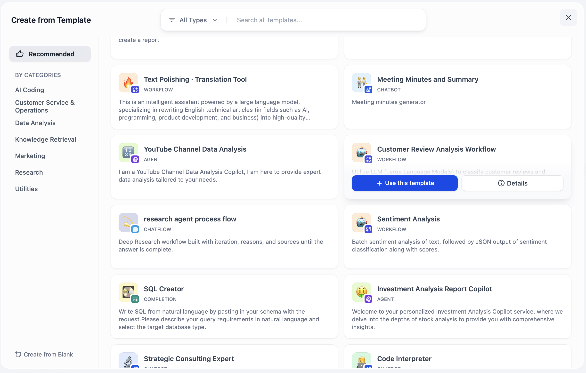

You can either start from the template or import the workflow directly.
In this tutorial, we will import the workflow to save time.
- Download the .yml file:
. 

In Dify, 
1. Click “Create App”
2. Select “Import DSL File”
3. Upload the .yml file
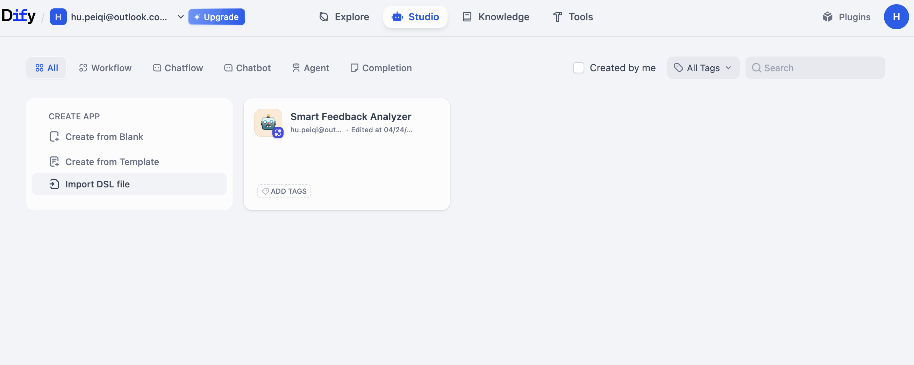
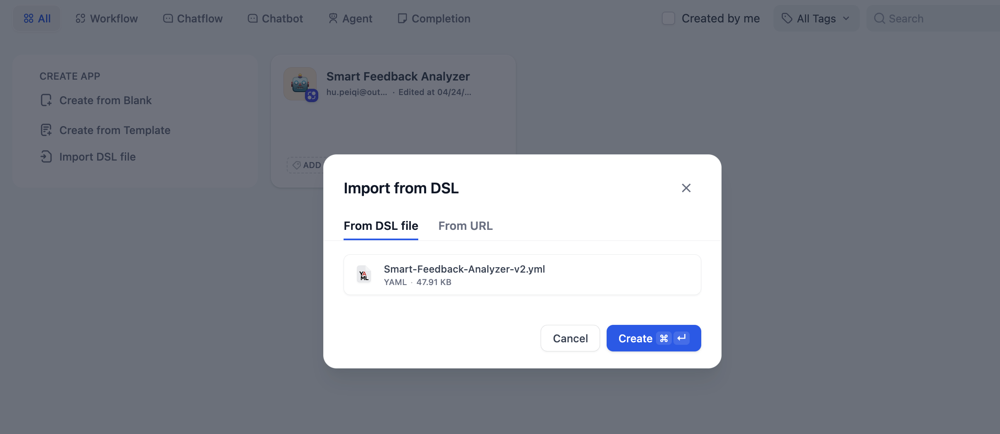

Once imported, you see the full workflow:
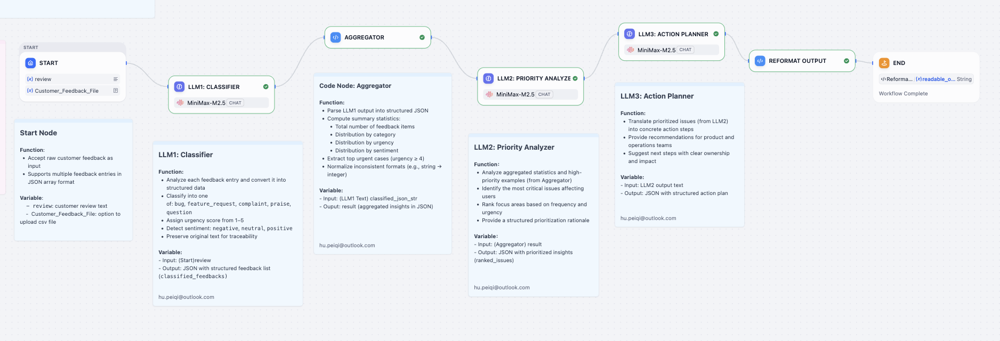

### Workflow Structure
The workflow includes 7 main parts:
- Start: Input customer feedback
- LLM1 – Classifier: classify and structure each feedback
- Code Node – Aggregator: Counts and summarizes the data
- LLM2 – Priority Analyzer: Ranks urgency based on impact
- LLM3 – Action Planner: Generates action plans for teams
- Code Node – Reformat Output: Converts JSON into readable Markdown
- End: Final output shown to the user


## Step 2: Set input for Start Node
Hover mouse over 'Start' Node, and click 'Run this step'. A panel will appear on the right:
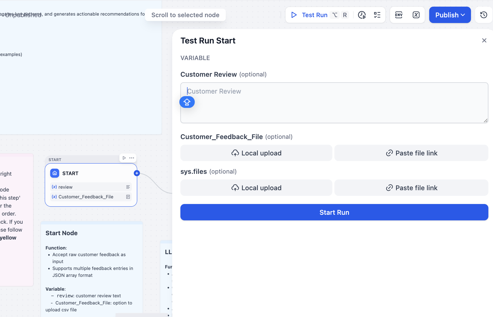

For a quick test, format your feedback like this JSON: ["feedback1", "feedback2" ...].

You may also see an option called 'Customer_Feedback_File'. This is for CSV input, but it is not used in this version of the workflow, you can skip it. 

Click 'Start Run' to test the node. A successful output will look like this:
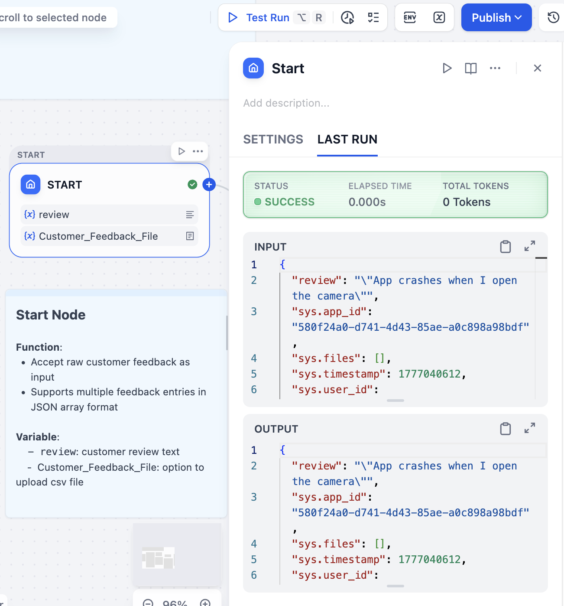


## Step 3: Configure the LLM nodes
Click on an LLM node (for example, LLM1).
- Click the model name
- Open **Model Settings**
- Choose a model from the dropdown
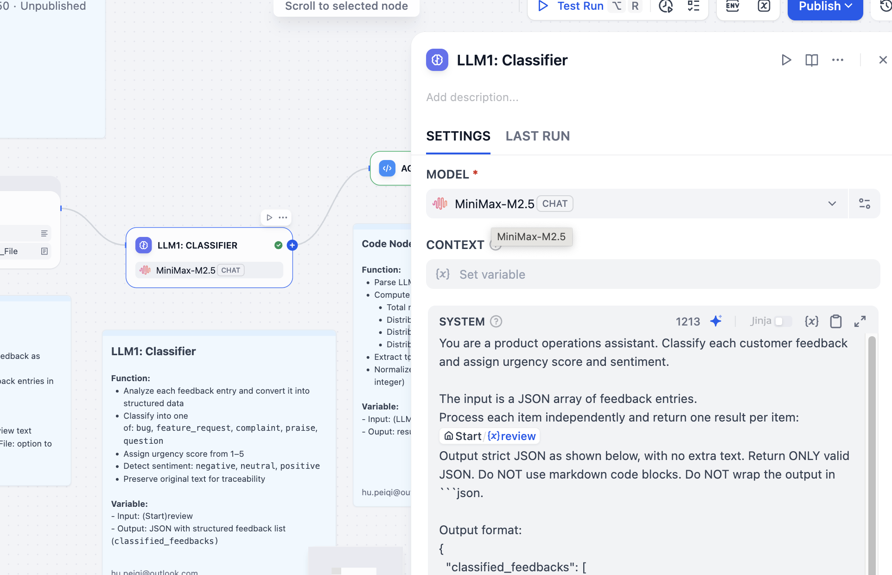

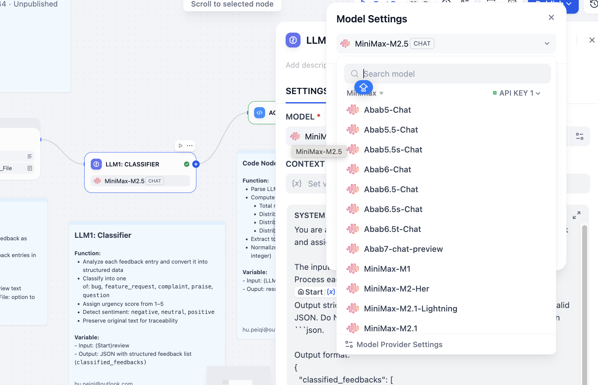

### Set up API keys
Scroll to the bottom of the dropdown and click '**Model Provider Settings**'.

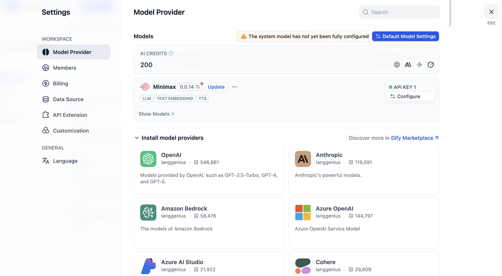

Install your model providers,then click '**Configure**' to enter your API key of your model.

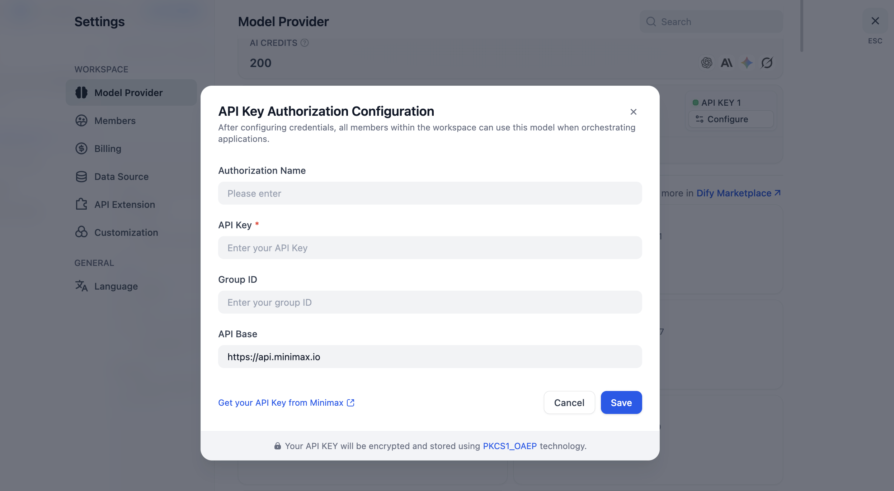

Make sure your API base URL is correct.
For example, Minimax may use a different API base depending on your country. Always double check with your model providers' documentations. 

### Edit prompts (optional)
You can keep the default prompts or modify them base on your needs. All prompt examples are included at the end of this tutorial for your reference in the *Prompts Section*.

Repeat these steps for each LLM node. 


## Step 4: Run a full test
Click '**Test run**' in the top right of the screen, this will start running the whole workflow from beginning to end. It will take a while if you test run the whole workflow at once. 

Enter your input. For a quick test, you can copy text below and paste to the entry.  
[
  "App crashes when I open the camera",
  "Love the dark mode!",
  "Payment failed twice today",
  "Can you add search to history?",
  "Login takes 10 seconds every time"
]

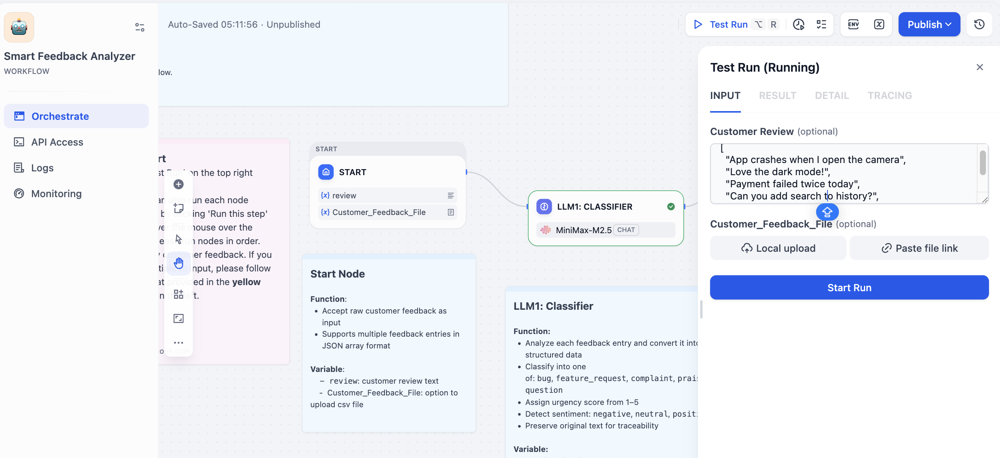

### If the workflow gets stuck
This may happen in the current version, try the following: 
- Run each node manually by hovering over it and selecting “**Run this step**".
- Execute nodes in order to avoid dependency issues.
- A successful node run will show a green checkmark in the top-right corner.
- To verify details, click the node and open the “**Last Run**” tab (next to “Settings”). The status should be “Success", and you can view the details of output.

*Example (LLM1)*
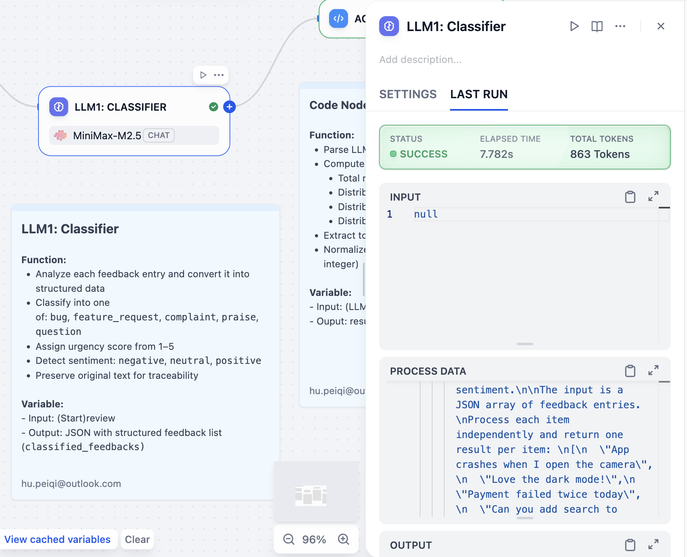

**View the final output**:
- After running all nodes in order, click the "**Reformat Output**" code node to see the final result like below:

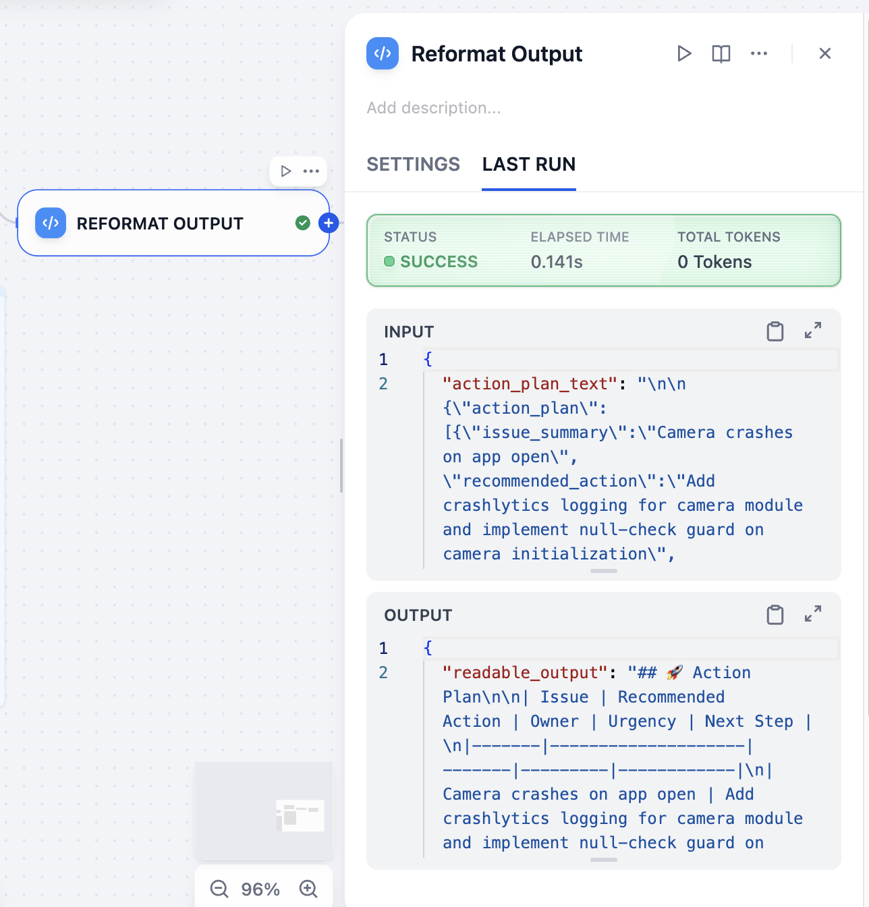

*Example Output*
Test result:
{
  "readable_output": "## 🚀 Action Plan\n\n| Issue | Recommended Action | Owner | Urgency | Next Step |\n|-------|--------------------|-------|---------|------------|\n| Camera crashes on app open | Add crashlytics logging for camera module and implement null-check guard on camera initialization | engineering | immediate | Instrument camera module with crashlytics to capture stack trace on next crash |\n| Payment processing failures | Implement idempotent payment retries with exponential backoff and add detailed error logging | engineering | immediate | Add structured logging to payment service and test with sandbox API credentials |\n| General app stability improvements | Conduct performance audit and fix top memory leaks identified in Profiler | engineering | short_term | Run Xcode Instruments to profile app and document top 5 memory leak locations |\n"
}

## Step 5: Use the Web App
To share and showcase your workflow: 
1. Clik '**Publish**' (top right corner of the screen)
2. Click '**Publish Update**'. 

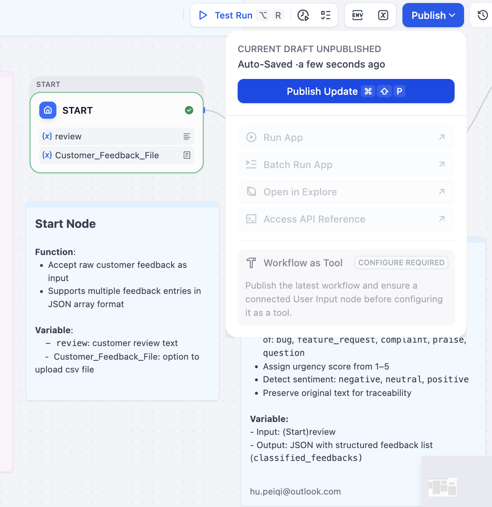

### Get the web app link
Click the small icon on the top-left (next to your workflow title) of the panel on the left. 

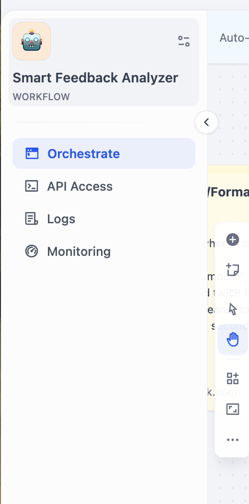

Copy the generated URL, you can now share and test your workflow through web link. 
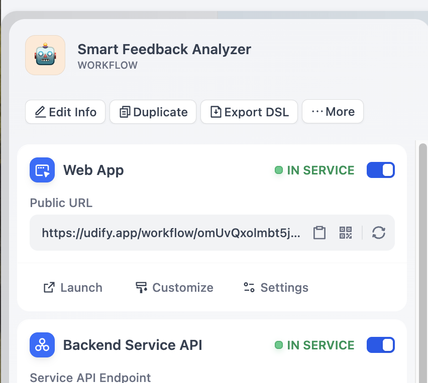


### Download the workflow
You can also download the workflow DSL file as .yml file here to:
- Save a copy
- Share with your team
- Make further changes 


## Prompts
### LLM1
You are a product operations assistant. Classify each customer feedback and assign urgency score and sentiment.

The input is a JSON array of feedback entries.
Process each item independently and return one result per item: {{}}
Output strict JSON as shown below, with no extra text.
Return ONLY valid JSON.
Do NOT use markdown code blocks.
Do NOT wrap the output in ```json.

Output format:
{
  "classified_feedbacks": [
    {
      "id": 0,
      "original_text": "the exact feedback string",
      "category": "one of [bug, feature_request, complaint, praise, question]",
      "urgency_score": "integer 1-5",
      "sentiment": "one of [negative, neutral, positive]"
    }
  ]
}

Rules:
- urgency_score 5: critical (app crash, payment failure, data loss, blocked usage)
- urgency_score 4: major frustration or repeated complaints
- urgency_score 3: moderate issues or important feature requests
- urgency_score 2: minor issues or general questions
- urgency_score 1: praise or low-impact feedback
- sentiment reflects overall tone.
- If vague → category = question, urgency_score = 2, sentiment = neutral.
- Keep original_text exactly as given.
- Assign id sequentially starting from 0.


### LLM2
You are a product manager. Based on the aggregated summary and top urgent examples, identify the top 3 most important issues to solve.

Input: Here is the aggregated summary and top urgent examples: {{ }}

Output strict JSON as shown below, with no extra text. Return ONLY valid JSON. Do NOT use markdown code blocks. Do NOT wrap the output in ```json.

Output format:
{
  "ranked_issues": [
    {
      "rank": 1,
      "issue_summary": "short title of the problem",
      "business_priority": "high/medium/low",
      "representative_feedback": "one exact feedback quote that best illustrates the issue",
      "justification": "why this is a priority (frequency, severity, sentiment, business impact)"
    }
  ]
}


Rules:
- Output exactly 3 items. If less than 3 distinct issues exist, use "Other improvements" for remaining ranks with business_priority = low.
- business_priority = high: urgency_score 4-5 or appears in top_urgent_examples or count >= 3.
- business_priority = medium: moderate frequency or urgency_score 3.
- business_priority = low: minor issues, feature requests, or praise.
- representative_feedback must be copied exactly from original feedback.
- justification under 25 words.
- No extra text outside JSON.


### LLM 3
You are a product operations lead. For each ranked issue, provide a concrete action plan.

Output strict JSON as shown below, with no extra text. Return ONLY valid JSON. Do NOT use markdown code blocks. Do NOT wrap the output in ```json.

Output format:
{
  "action_plan": [
    {
      "issue_summary": "same as in ranked_issues",
      "recommended_action": "specific, actionable step (e.g., 'Add crashlytics logging for camera module')",
      "owner": "engineering / design / product / support",
      "urgency": "immediate / short_term / long_term",
      "next_step": "first concrete task (max 20 words)"
    }
  ]
}

Rules:
- For business_priority = high → urgency = immediate or short_term.
- For low priority → urgency = long_term.
- recommended_action must be something a team can execute; avoid vague words like "improve" or "consider".
- next_step should be doable within a day for immediate, or a week for short_term.
- Output exactly the same number of actions as input issues (usually 3).
- No extra text outside JSON.

**User prompt**:
Based on these ranked issues, create an action plan:
{{ranked_json}}


